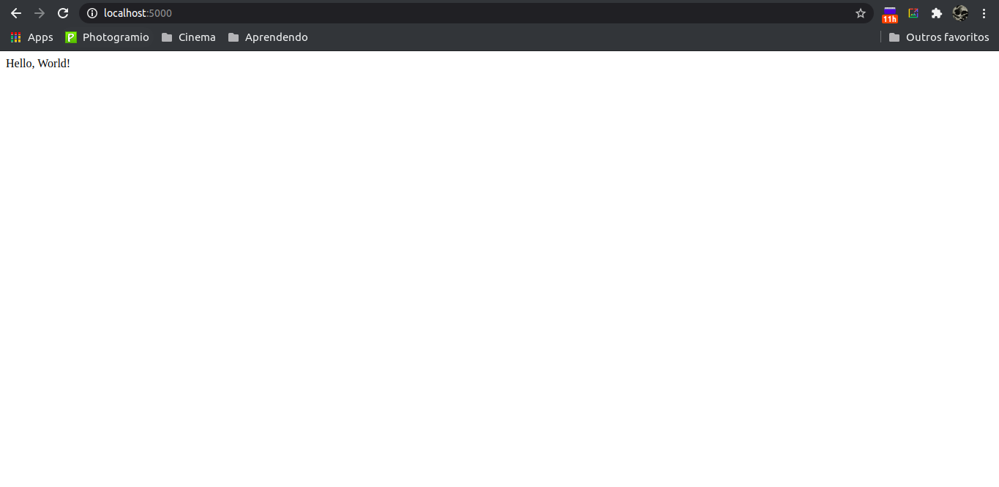
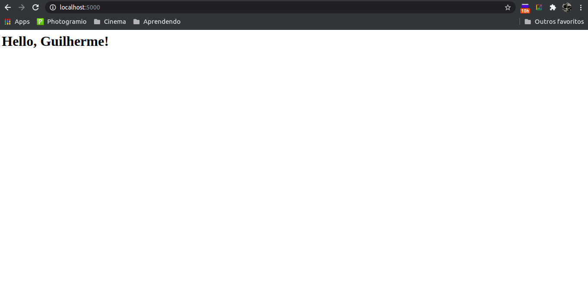
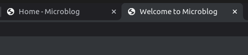
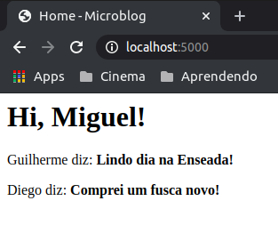
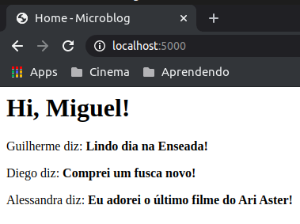
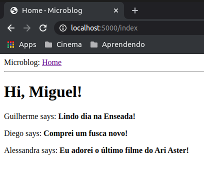
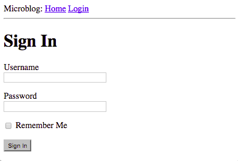
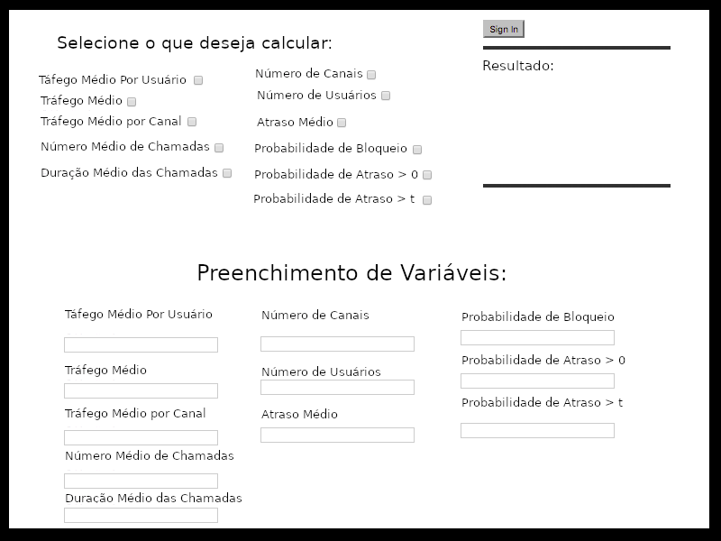

# Curso de Desenvolvimento de Aplicação Web em Python produzido por Miguel Grinberg.

[Site do Curso](https://blog.miguelgrinberg.com/post/the-flask-mega-tutorial-part-i-hello-world)

## Aula1: Instalando e criando primeira aplicação:

A aplicação utiliza o pacote FLASK do python3.
****
**Preparando as ferramentas:**

Foi criado um diretório, dentro foi criado um ambiente virtual:

> $ python3 -m venv venv

O comando cria um diretório venv onde um ambiente virtual pode ser criado. O ambiente virtual é ativado usando o comando:

> $ source venv/bin/activate

> (venv) $ -

O terminal passa a executar os comandos pelo ambiente virtual.
Todo esse sistema foi criado para garantir o funcionamento do Flask na versão atual intacta.

Neste momento o Flask pode ser instalado dentro do ambiente virtual, como se instala qualquer outro pacote em python:

> $ (venv) $ pip install flask
****
**A primeira aplicação: Hello World**

Foi criado um diretório onde a aplicação vai rodar, no mesmo diretório microblog onde o diretório *venv* existe, que roda o ambiente virtual.

> (venv) $ mkdir app


Dentro dele foram criados arquivos .py que rodam coisas diferentes. O primeiro, nomeado __ init __.py inicia a aplicação.

*microblog/app/__ init __.py* :
```python
from flask import Flask

app = Flask(__name__)

from app import routes
```
O segundo, routes.py, dá as diferentes URL que a aplicação implementa.

*microblog/app/routes.py* :
```python
from app import app

@app.route('/')
@app.route('/index')
def index():
    return "Hellow, World!"
```
Para completar esta primeira aplicação, é criado na raiz do diretório do projeto (nesse caso a paste microblog) uma execução em python que chama a aplicação

*microblog/microblog.py*
```python:
from app import app
```

Aqui é dito ao Flask o que ele deve rodar:
> (venv) $ FLASK_APP=microblog.py

E a aplicação pode ser executada fazendo:

> (venv) $ flask run

> * Serving Flask app "microblog"

> * Running on http://127.0.0.1:5000

Que pode ser finalizada apertando CTRL+C

A aplicação web pode ser acessada no endereço que vem como resposta do flask run, 127.0.0.1:5000. 127.0.0.1 pode ser encurtado por localhost, fazendo com que a aplicação possa ser verificada em http://localhost:5000

A imagem do site em execução pode ser visto na figura 1.



`Figura 1: Modelo inicial do website em execução no localhost`

Para encurtar futuras execuções, o comando ao flask pode ser resumido criando um arquivo .flaskenv na raíz do diretório contendo:

```bash 
FLASK_APP=microblog.py
```

Para isso funcionar, antes deve ser instalado o pacote dotenv com o comando:

> (venv) $ pip install python-dotenv

****

## Aula 2: Continuando a implementação do site modelo e aprendendo a usar templates (entre outras ferramentas)

Neste capítulo, o curso introduz o conceito de templates, adentra em ferramentas HTML e faz a utilização destes modelos no upgrade do website inicial.

O primeiro upgrade é modificar o retorno do código que implementa a saída expressa na página criada, utilizando HTML. A documentação html de apoio pode ser encontrada em:

[HTML Markup](https://en.wikipedia.org/wiki/HTML#Markup)

A modificação ficou:

*app/routes.py* :
```python
from app import app
@app.route('/')
@app.route('/index')
def index():
    user = {'username':'Guilherme'}
    return '''
<html>
    <head>
        <title> Home Page - Microblog </title>
    </head>
    <body>
        <h1> Hello, ''' + user['username'] + '''!</h1>
    </body>
</html>'''
```

O resultado da modificação pode ser visto na figura 2.



`Figura 2: Segundo modelo do site, pós modificação e inserção de código HTML`

****
**Templates:**

Aqui é introduzido o conceito de templates pela dificuldade de modificar o código quanto este se torna longo demais, adicionando um novo diretório:

> (venv) $ mkdir app/templates

Neste diretório o template em HTML será colocado e este será utilizado e modificado o quanto for preciso. O curso ensina a utilizar o template logo depois.

O código html é inserido em /app/templates/index.html e segue como:

*/app/templates/index.html* :
```html
<html>
    <head>
        <title>{{title}} - Microblog</title>
    </head>
    <body>
        <h1>Hello, {{ user.username }}!</h1>
    </body>
</html>
```

E a utilização do template no código em python fica:

*/app/routes.py* :

```python
from flask import render_template
from app import app

@app.route('/')
@app.route('/index')
def index():
    user = {'username':'Guilherme'}
    return render_template('index.html', title='Home', user=user)

```

Todo esse funcionamento acontece usando o *render_template* do framework do Flask, função que implementa um template em uma página HTML completa considerando as variáveis abertas.

O *render_template*, na realidade, faz mais do que isso, invocando a engina [Jinja2](https://jinja.palletsprojects.com/en/2.11.x/) que substitui qualquer entrada do tipo {...} pelas variáveis passadas pela chamada do *render_template*.

****

**Condicionais em Jinja2:**

Há operações que podem ser feitas utilizando o Jinja2, dentre elas, condicionais podem ser realizadas dentro do template utilizando a tag **, a próxima versão do index.html faz uso disso como exemplo:

*app/templates/index.html* :
```html
<html>
    <head>
        
        <title>{{title}} - Microblog</title>
        
        <title>Welcome to Microblog</title>
        
    </head>
    <body>
        <h1>Hello, {{ user .username }}!</h1>
    </body>
</html>
```

Este código é um pouquinho mais inteligente e considera que se a função em python passar um título, este será adicionado a tab do website. Se não, o título default *Welcome to Microblog* será colocado no lugar, tudo utilizando condicionais no template realizado no index.html. As duas formas podem ser vistas na figura 3.



`Figura 3 - Titulo do site modificado através da condicional com e sem título nos parâmetros da chamada do render template, respectivamente.`

Na segunda forma, simplesmente foi suprimido o `title = home` do código em `routes.py`.
****

**Loops em Jinja2:**

O curso introduz o conceito de loops feitos no template utilizando Jinja2. Ele cria uma lista em `routes.py` de posts que poderão ser vistos no site modelo. O código em python fica:

*/app/routes.py:*
```python
from flask import render_template
from app import app

@app.route('/')
@app.route('/index')
def index():
    user = {'username': 'Miguel'}
    posts = [
        {
            'author': {'username': 'Guilherme'},
            'body': 'Lindo dia na Enseada!'
        },
        {
            'author': {'username': 'Diego'},
            'body': 'Adorei o ultimo filme do Ari Aster'
        }
    ]
    return render_template('index.html', title='Home', user=user, posts=posts)
```

A sintaxe utilizada em posts determina uma lista que contém um autor e um corpo e é passada como parâmetro no final do código para o *render_template*, que o executa utilizando o tempalte criado em *index.hmtl*.

A listas de posts pode ter tamanho variável, por isso foi necessário criar um loop e percorrer toda a lista. O Jinja2 oferece o controlador **for** para essa probelmática, deixando o código da seguinte forma:

*/app/templates/index.html* :
```html
<html>
    <head>
        
        <title>{{ title }} - Microblog</title>
        
        <title>Welcome to Microblog</title>
        
    </head>
    <body>
        <h1>Hi, {{ user.username }}!</h1>
        
        <div><p>{{ post.author.username }} diz: <b>{{ post.body }}</b></p></div>
        
    </body>
</html>
```
O resultado dessa modificação pode ser vista na figura 4.1 (com dois posts) e na figura 5 (com três posts), sendo que a única modificação feita foi a adição do post final a lista em `routes.py`.



`Figura 4 - Utilização de loop para a criação de estrutura de repetição com dois posts.`



`Figura 5 - Utulização de loop para a criação de estrutura de repetição com três posts.`

****

**Herança de Templates:**

Se há uma sessão que estará presente em todas as páginas de um site, é possível criar um template único e herdá-lo para outros templates.

Aqui foi movido uma base para um outro arquivo, chamado `base.html`, onde será colocada uma estrutura base que poderá ser invocada pelo template `index.html` ou por qualquer outro de outra página. No caso deste exemplo será uma simples barra de navegação.

*/app/templates/base.html* :

```html
<html>
    <head>
      
      <title>{{ title }} - Microblog</title>
      
      <title>Welcome to Microblog</title>
      
    </head>
    <body>
        <div>Microblog: <a href="/index">Home</a></div>
        <hr>
        
    </body>
</html>
```
O controlador  define o local onde o código de um outro arquivo html que extende `base.html` será implementado automaticamente. Além disso foi criado um link no corpo desta base, que aponta para este mesmo site. A sintaxe do link pode ser compreendida no documento HTML já apresentado neste github.

O código de `index.html` fica um pouco diferente, apenas extendendo o código de `base.html`:

*/app/templates/index.html* :
```html



    <h1>Hi, {{ user.username }}!</h1>
    
    <div><p>{{ post.author.username }} says: <b>{{ post.body }}</b></p></div>
    

```
Aqui, o `base.html` toma conta do título e de toda a estrutura do site, e o `index.html` o extende, implementando a parte específica dessa página. O controlador Jinja2  faz com que um arquivo html se insira entre o ramo  do arquivo base mencionado. 

Se for necessário criar outra página com a mesma estrutura, neste caso, é possível fazer um outro arquivo html que também extende o `base.html` e serão garantidas à ele todas as características que o `index.html` herda neste exemplo. O resultado pode ser visto na figura 6.



`Figura 6 - Site executado com base e implementação com herança de templates`

Pode ser observada a estrutura combinada dos dois códigos, da `base.html` que implementa a esturutra e coloca o link que pode ser visto no topo da página, e também do `index.html` que implementa a saudação e a lista de posts.

****

## Aula 3: Inputs e Web Forms

WebForms estão entre os blocos mais básicos da construção de qualquer aplicação WEB. Eles serão usados para fazer submissões de dados e entrada de informações por parte do usuário.

Para fazer o uso de Web Forms, será utilizada a extensão *Flask-WTF* que faz uso de *WTFForms* que se integram muito bem com o *Flask*. Essa é apenas uma das extensões do Flask (e mais serão utilizadas no futuro do curso), alternativa que ajuda muito na produção de *websites* com a utilização de recursos já prontos.

A instalação do *Flask-WTF* é feita através de: 

> (venv) $ pip install flask-wtf

****

**Configuração**

A aplicação desenvolvida até agora é simples e não necessita de configuração. Aplicações maiores (e algumas extensões do *Flask*) permitem certa liberdade de configuração que você passa como um *framework* como configuração de variáveis.

A solução mais básica de configuração é definir suas variáveis em como chaves em um arquivo `app.config` que utiliza as variáveis como que em um dicionário. É possível fazer algo desta forma:

```python
app = Flask(__name__)
app.config['SECRET_KEY'] = 'you-will-never-guess'
#... adicionar mais variáveis aqui se for necessário
```

Uma maneira mais eloquente pode ser feita, separando os arquivos e criando uma classe em python para guardar as variáveis de configuração. Para isso será criado um novo módulo em python com a classe mencionada, criado no diretório do projeto (microblog, no caso).

*/config.py* :
```python
import os

class Config(object):
    SECRET_KEY = os.enviroment.get('SECRET_KEY') or 'you-will-never-guess'
```

SECRET_KEY é uma variável de configuração, que é setada aqui nesta classe. Com a necessidade de mais configurações, novas variáveis podem ser adicionadas nesse arquivo. 

SECRET_KEY é uma das poucas variáveis obrigatórias para aplicações *Flask*, já que algumas aplicações usam o valor da SECRET_KEY como criptografia, como forma de evitar ataques em *web forms*.

Agora que existe um arquivo de configuração, é necessário dizer ao *Flask* que ele existe e que deve ser executado, isto é feito no `__init__.py`.

*/app/init.py* :
```python
from flask import Flask
from config import Config

app = Flask(__name__)
app.config.from_object(Config)

from app import routes
```

****

**Web Forms**

A extensão *Flask-WTF* usa classes python para criar formulários web. Uma classe form simplesmente define os campos dos formulários como variáveis.

De forma a separar em arquivos diferentes, será criado um arquivo em /microblog/app chamado `forms.py`. Será colocado um formulário de login que pede usuário e senha para quem quer entrar, além disso dois botões: um de relembrar a senha do usuário e outra de confirmar o envio das informações.

*/app/forms.py*
```python

from flask_wtf import FlaskForm
from wtforms import StringField, PaswordField, BooleanField, SubmitField
from wtforms.validators import DataRequired

class LoginForm(FLaskForm):
    username = StringField('Username', validators=[DataRequired()])
    password = PasswordField('Password', validators=[DataRequired()])
    remember_me = BooleanField('Remember Me')
    submit = SubmitField('Sign In')
```

Todos os *Fields* são classes importadas do wtforms, e neles são passadas descrições como parâmetros. Cada construção é feita de uma forma diferente, no caso, String, Password, Boolean e Submit.

O método DataRequired colocado nos validadores verifica se o campo foi cumprido para permitir progredir. Este é apenas um validador de vários, alguns outros serão utilizados durante o curso.

O objetivo é criar uma tela de Log In, como pode ser visto na figura 7.



`Figura 7 - Tela de Log In e Senha com os campos funcionando.`

O objetivo com este curso é a finalização do projeto de iniciação científica do desenvolvimento de uma ferramenta de aplicação WEB para o dimensionamento de capacidade e tráfego de voz do sistema de rádio digital tetra da PRF-SC. O modelo final previsto (neste ponto) para a aplicação pode ser visto na figura 8 e não é muito diferente do que foi proposto até agora pelo curso do professor Grinberg.



`Figura 8 - Previsão da versão final do projeto de IC`


